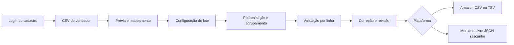

# Integrantes

1- Gabriel Riqueto RM98685

# ByteLab

Aplicação autenticada que lê CSVs de vestuário com cabeçalhos variados, normaliza os dados, identifica problemas por linha e prepara catálogos para revisão e exportação. A Amazon possui saída CSV/TSV por tipo; o Mercado Livre possui uma saída JSON experimental, sempre identificada como rascunho. O acesso exige conta e usa MongoDB.

Veja [PRODUCT_SPEC.md](PRODUCT_SPEC.md) para a especificação completa do produto.

## Rodar localmente

```bash
npm install
npm run dev
```

Abra http://localhost:3000. Use [public/exemplo-produtos.csv](public/exemplo-produtos.csv) para testar o fluxo completo (ou o link "Baixar planilha de exemplo" na própria tela de upload).

## Verificar o projeto

```bash
npm run typecheck
npm test
npm run build
```

O comando `npm run check` executa as três verificações em sequência.

## Fluxo



O CSV pode incluir `grupo`/`modelo`, `tipo_produto`, `departamento`, `quantidade`/`estoque` e `url da imagem`. **Imagem é opcional**: a coluna pode faltar ou conter células vazias, sem bloquear produtos nem impedir a exportação. Cabeçalhos equivalentes são reconhecidos; colunas essenciais ausentes não travam a importação, mas bloqueiam os produtos afetados na validação. Sem coluna de estoque, o valor padrão do lote é aplicado. `grupo` é recomendado quando as variações possuem nomes ligeiramente diferentes.

O arquivo é decodificado como UTF-8 de forma estrita. Acentos, `R$` e preços entre aspas como `"R$ 49,90"` são aceitos; somente bytes inválidos para UTF-8 geram erro de codificação. Um CSV estruturalmente malformado gera mensagem por linha. Erros nos produtos (por exemplo SKU repetido ou preço inválido) aparecem após a configuração, na Validação.

## Estrutura

- `lib/csv.ts` — parsing do CSV de entrada (com aliases de cabeçalho) e geração do CSV/TSV de saída
- `lib/dictionaries.ts` — normalização de texto, dicionários de cor e tamanho
- `lib/preco.ts` — parsing de preço (BR e US)
- `lib/gtin.ts` — normalização, identificação de tipo e validação do dígito verificador de GTIN/EAN/UPC
- `lib/group.ts` — agrupamento pai/filho, geração de SKU, cálculo de tema de variação, edição/remapeamento de linhas
- `lib/validation-summary.ts` — agrega as issues calculadas para cards e detalhes por linha, sem números estáticos
- `components/PassoValidacao.tsx` — categorias clicáveis com navegação até a variação para correção
- `lib/platforms/` — formatadores específicos de plataforma
- `lib/server/` — conexão MongoDB, autenticação, sessão e controles de segurança
- `app/api/` — endpoints de conta e catálogos, executados somente no servidor
- `lib/validate.ts` / `lib/types.ts` — validação de campos e tipos compartilhados
- `components/` — fluxo principal, conta e histórico de catálogos

## Privacidade

- O CSV bruto é lido e processado no navegador; nunca é salvo automaticamente.
- O salvamento local do progresso é opcional e desativado por padrão.
- Quando ativado, a sessão fica somente no navegador, vinculada ao usuário autenticado, expira em até sete dias e é apagada no logout.
- Catálogos processados só são enviados ao MongoDB após login e clique em “Salvar na conta”.
- Senhas usam scrypt com salt individual; sessões usam cookie HttpOnly e token hasheado no banco.
- O usuário pode apagar os dados imediatamente pela interface.
- As miniaturas são carregadas diretamente das URLs informadas, sem envio do CSV a um servidor ByteLab.

Veja [PRIVACIDADE.md](PRIVACIDADE.md) para as medidas implementadas e o checklist necessário antes de uma implantação real.

## Funcionalidades de qualidade

- prévia antes da importação e limite de arquivo;
- mensagens para CSV malformado ou com codificação inválida;
- detecção de SKU ausente/repetido, campos essenciais vazios, preço/estoque inválidos, tamanhos não reconhecidos/inválidos e falhas de normalização; URL de imagem ausente não gera ocorrência; URL preenchida em formato inválido gera apenas alerta;
- validação de GTIN por formato e dígito verificador;
- filtros por status, navegação até problemas e histórico para desfazer;
- correção de URL de imagem e separação de uma variação em novo grupo;
- exportação com pai seguido de seus filhos e proteção contra fórmulas de planilha.
- cadastro/login, limitação de tentativas, sessão de sete dias e exclusão de conta;
- histórico isolado por usuário com salvamento e exclusão explícitos;
- destino Mercado Livre em JSON de rascunho com disclaimer visível.

## Limitações conhecidas (por design, ver §8 e §13 do PRODUCT_SPEC)

O arquivo Amazon cobre campos centrais de um listing de vestuário, mas **não** substitui o template oficial da categoria exata — trate-o como ponto de partida para conferência no Seller Central.

Um lote misto gera um ZIP com arquivo por tipo. Tipos detectados pelo nome ficam marcados para confirmação. A exportação inclui somente variações sem erros críticos e seus pais; alertas devem ser conferidos. O arquivo **não é upload direto garantido** e não consulta atributos variáveis de subcategorias. A importação atual aceita CSV UTF-8, não XLSX. Login/cadastro exigem MongoDB configurado; os testes automatizados locais cobrem processamento/exportação. Para testar autenticação ponta a ponta, siga `MONGODB_SETUP.md`.

A saída Mercado Livre é deliberadamente um **rascunho não validado pela API**. Categoria, atributos obrigatórios, imagens, variações, tipo de anúncio e autorização OAuth precisam ser consultados na API oficial antes de qualquer publicação. O ByteLab não envia dados diretamente a marketplaces nesta versão.
